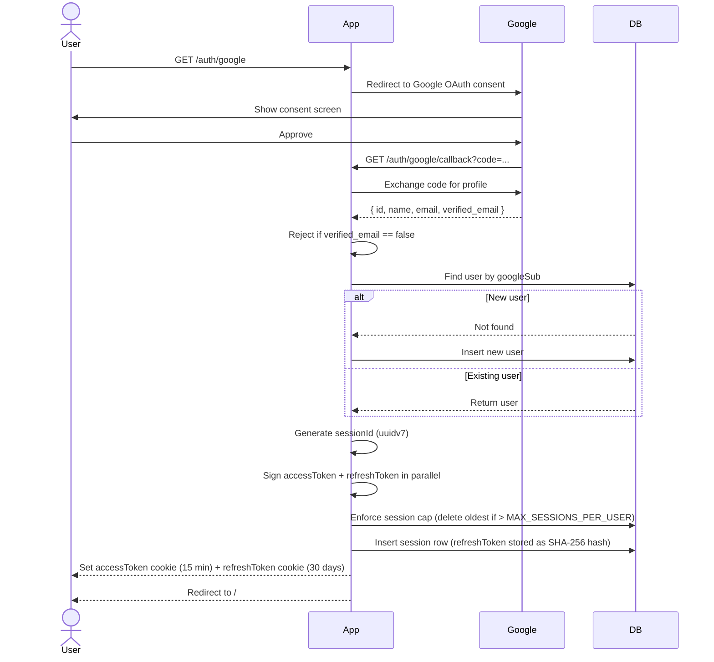
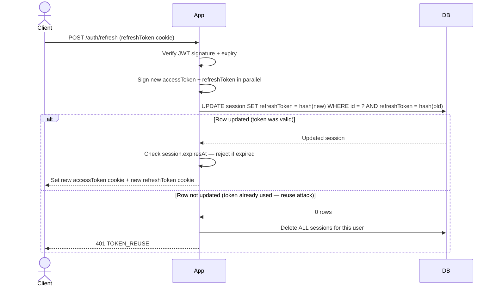
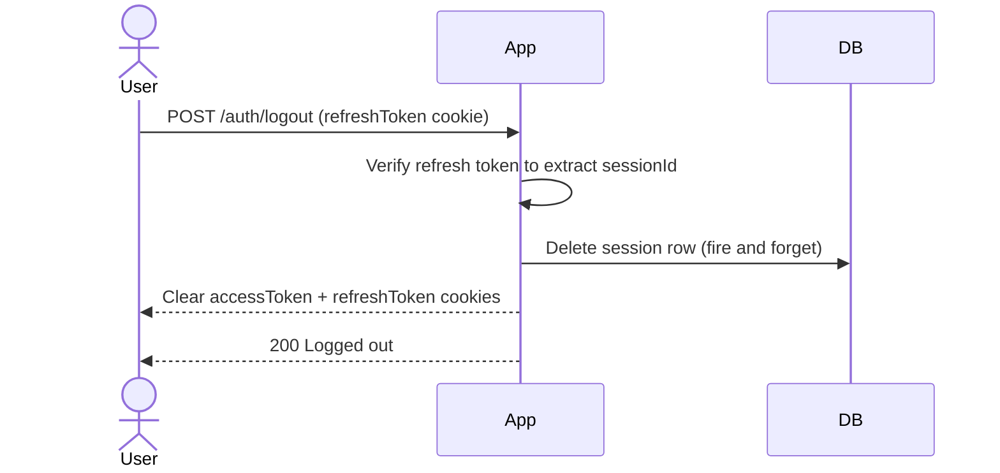
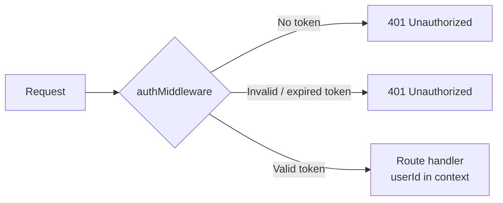
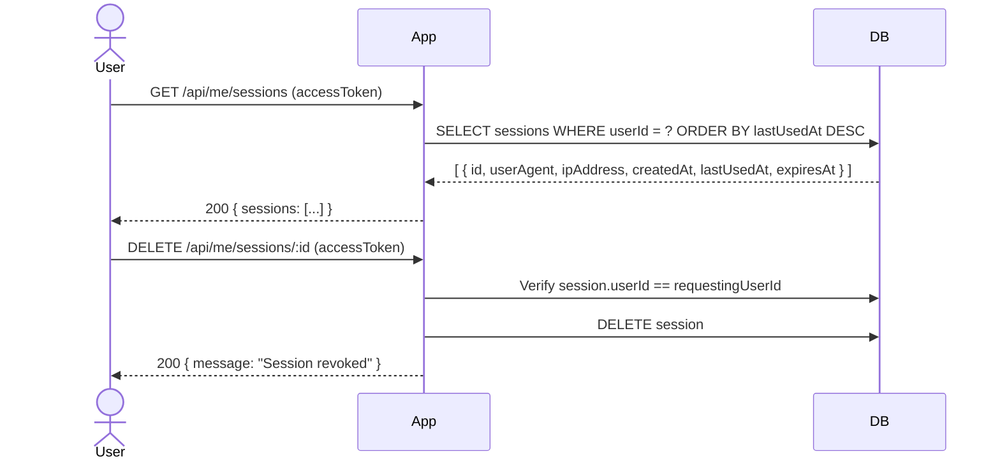

# Authentication

This app uses Google OAuth for login. There's no username/password — users sign in with their Google account and we issue our own JWTs from there.

---

## How it works at a high level

When someone logs in, we give them two tokens:

- **Access token** — short-lived (15 minutes), used on every API request
- **Refresh token** — long-lived (30 days), used only to get a new access token

Both are stored as `HttpOnly` cookies, so JavaScript on the page can never read them.

---

## Login flow

---

## Refreshing the access token

The access token expires after 15 minutes. When that happens, the client calls `POST /auth/refresh`. The refresh token gets rotated on every call — the old one is thrown away and a new one is issued.

### Why rotate the refresh token?

If someone steals a refresh token and uses it, the next time the real user tries to refresh, the old token won't match what's in the DB. We detect that and kill every session for that account.

### Why hash the refresh token?

Refresh tokens are stored as SHA-256 hashes in the DB. A full DB breach can't yield tokens that could be replayed — the raw values only ever live in the signed JWT cookies.

---

## Logout

The session delete is fire-and-forget — cookies are cleared regardless of whether the DB call succeeds.

---

## How protected routes work

The middleware checks the `Authorization: Bearer` header first, then falls back to the `accessToken` cookie. Either way works.

---

## Session management

Users can list and revoke their own sessions. This is useful for "sign out everywhere" flows or auditing active devices.

Raw `refreshToken` hashes are never returned — only metadata.

---

## Database tables

### users

| Column | Type | Notes |
|---|---|---|
| id | text | UUIDv7, primary key |
| name | varchar(255) | From Google profile |
| email | varchar(255) | Unique, indexed |
| google_sub | varchar(255) | Google's user ID, unique, indexed |
| city | varchar(255) | Optional, user-editable |
| photo | varchar(500) | Optional, user-editable |
| gender | enum | `male`, `female`, `other`, user-editable |
| created_at | timestamp | Auto |
| updated_at | timestamp | Updated on every `PATCH /api/me` |

### sessions

| Column | Type | Notes |
|---|---|---|
| id | text | UUIDv7, primary key |
| user_id | text | FK → users.id, cascade delete, indexed |
| refresh_token | text | SHA-256 hash of the raw token |
| expires_at | timestamp | 30 days from creation, indexed |
| created_at | timestamp | Auto |
| last_used_at | timestamp | Updated on every token rotation |
| user_agent | varchar(500) | Browser/device info |
| ip_address | varchar(45) | First IP from x-forwarded-for; supports IPv6 |

One user can have multiple sessions (multiple devices). Max concurrent sessions is configurable via `MAX_SESSIONS_PER_USER` (default 5). Oldest sessions are pruned automatically when the cap is hit. Deleting a user cascades to all their sessions.

---

## Cookies

| Cookie | HttpOnly | Secure (prod) | SameSite | Max-Age |
|---|---|---|---|---|
| accessToken | yes | yes | Lax | 15 minutes |
| refreshToken | yes | yes | Lax | 30 days |

`Secure` is only set in production (`NODE_ENV=production`) so local dev over HTTP still works.

---

## Endpoints

### Auth

| Method | Path | Auth | Rate limit | What it does |
|---|---|---|---|---|
| GET | `/auth/google` | No | 20 / 15 min | Initiate Google OAuth |
| GET | `/auth/google/callback` | No | 20 / 15 min | Google redirects here after consent |
| POST | `/auth/refresh` | No | 30 / 15 min | Rotate refresh token, issue new access token |
| POST | `/auth/logout` | No | 20 / 15 min | Delete session, clear cookies |

### User profile & sessions

| Method | Path | Auth | Body | What it does |
|---|---|---|---|---|
| GET | `/api/me` | Yes | — | Current user profile (googleSub excluded) |
| PATCH | `/api/me` | Yes | `{ name?, city?, photo?, gender? }` | Update profile fields |
| GET | `/api/me/sessions` | Yes | — | List all active sessions (no token hashes) |
| DELETE | `/api/me/sessions/:id` | Yes | — | Revoke a specific session by ID |

### System

| Method | Path | Auth | What it does |
|---|---|---|---|
| GET | `/health` | No | `{ status: "ok", timestamp }` |

---

## Token lifetimes

