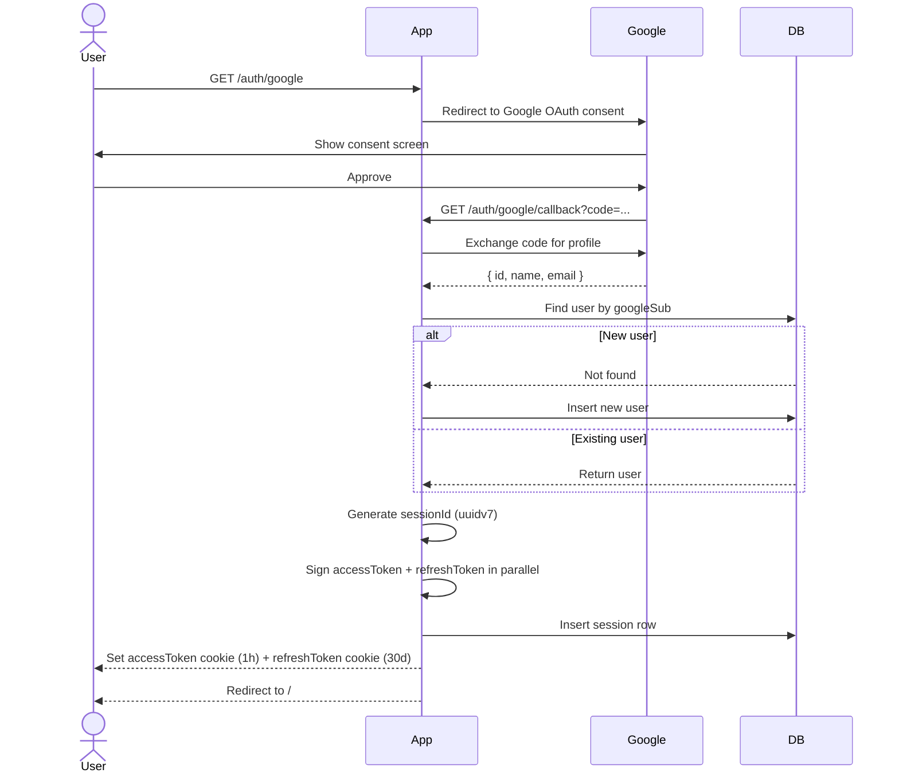
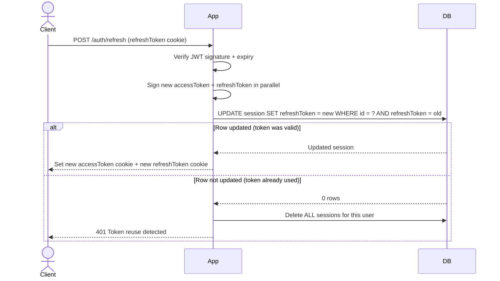
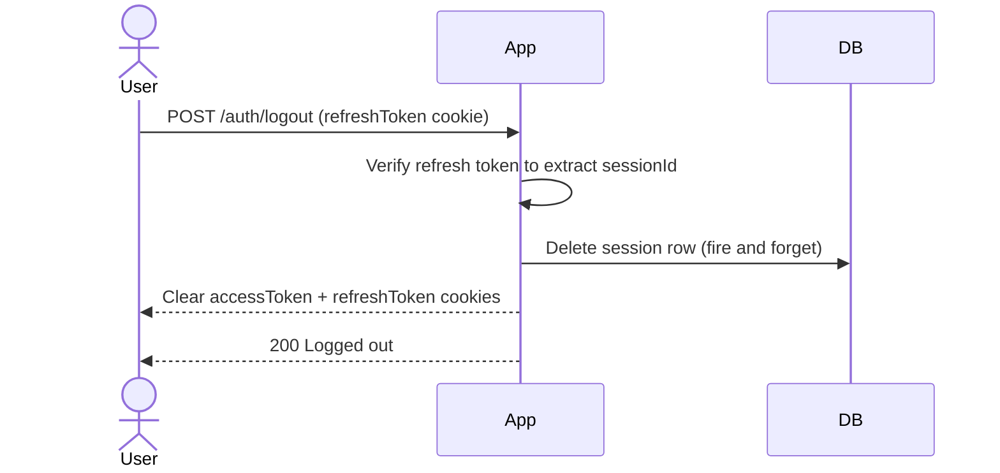
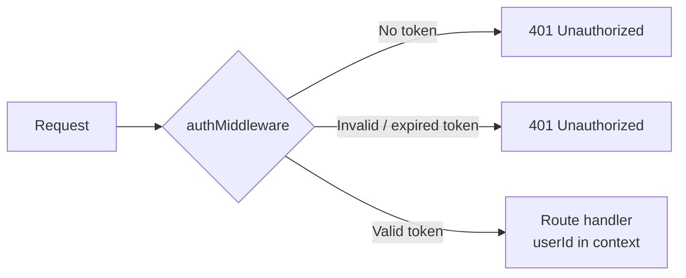

# Authentication

This app uses Google OAuth for login. There's no username/password — users sign in with their Google account and we issue our own JWTs from there.

---

## How it works at a high level

When someone logs in, we give them two tokens:

- **Access token** — short-lived (1 hour), used on every API request
- **Refresh token** — long-lived (30 days), used only to get a new access token

Both are stored as `HttpOnly` cookies, so JavaScript on the page can never read them.

---

## Login flow

---

## Refreshing the access token

The access token expires after 1 hour. When that happens, the client calls `POST /auth/refresh`. The refresh token gets rotated on every call — the old one is thrown away and a new one is issued.

### Why rotate the refresh token?

If someone steals a refresh token and uses it, the next time the real user tries to refresh, the old token won't match what's in the DB. We detect that and kill every session for that account.

---

## Logout

The session delete is fire-and-forget — cookies are cleared regardless of whether the DB call succeeds.

---

## How protected routes work

The middleware checks the `Authorization: Bearer` header first, then falls back to the `accessToken` cookie. Either way works.

---

## Database tables

### users

| Column | Type | Notes |
|---|---|---|
| id | text | UUIDv7, primary key |
| name | varchar(255) | From Google profile |
| email | varchar(255) | Unique |
| google_sub | varchar(255) | Google's user ID, unique |
| city | varchar(255) | Optional |
| photo | varchar(500) | Optional |
| gender | enum | `male`, `female`, `other` |
| created_at | timestamp | Auto |
| updated_at | timestamp | Auto |

### sessions

| Column | Type | Notes |
|---|---|---|
| id | text | UUIDv7, primary key |
| user_id | text | FK → users.id, cascade delete |
| refresh_token | text | Rotated on every refresh |
| expires_at | timestamp | 30 days from creation |
| last_used_at | timestamp | Updated on every refresh |
| user_agent | varchar(500) | Browser/device info |
| ip_address | varchar(45) | Supports IPv6 |

One user can have multiple sessions (multiple devices). Deleting a user cascades to all their sessions.

---

## Cookies

| Cookie | HttpOnly | Secure (prod) | SameSite | Max-Age |
|---|---|---|---|---|
| accessToken | yes | yes | Lax | 1 hour |
| refreshToken | yes | yes | Lax | 30 days |

`Secure` is only set in production (`NODE_ENV=production`) so local dev over HTTP still works.

---

## Endpoints

| Method | Path | Auth required | What it does |
|---|---|---|---|
| GET | /auth/google | No | Kicks off Google OAuth |
| GET | /auth/google/callback | No | Google redirects here after consent |
| POST | /auth/refresh | No | Rotates refresh token, issues new access token |
| POST | /auth/logout | No | Deletes session, clears cookies |
| GET | /api/me | Yes | Returns current user (no googleSub) |

---

## Token lifetimes

```mermaid
gantt
    title Token lifetimes
    dateFormat  X
    axisFormat  %s

    section Access Token
    Valid (1 hour)     : 0, 3600

    section Refresh Token
    Valid (30 days)    : 0, 2592000
```

